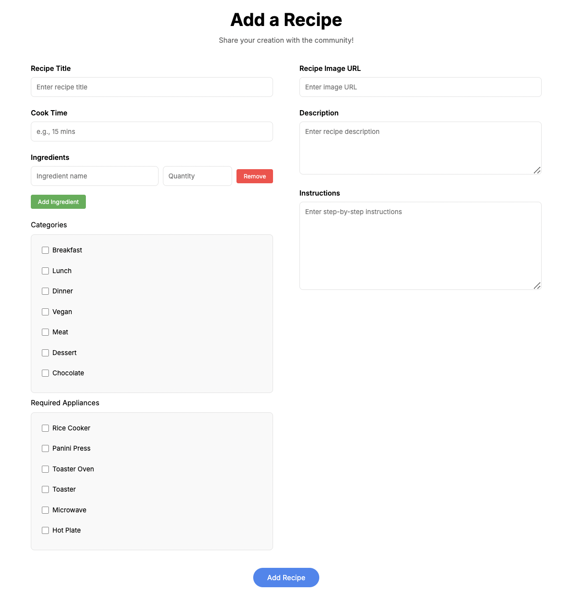

# Campus Cooking

## Table of contents

* [Overview](#overview)
* [User Guide](#user-guide)
* [Milestones](#milestones)
* [Deployment](#deployment)
* [Team](#team)

## Overview

Campus Cooking is an application that helps campus students make affordable, healthy, and accessible meals. It provides students with recipes that respect common constraints such as limited kitchen resources, limited cooking skills, limited time, and limited access to grocery stores.

### Key Features

* Recipes designed for basic kitchen setups, primarily using a toaster oven or microwave.
* Ingredients that are easy to find within walking distance of campus.
* Customizable filters for dietary preferences (e.g., vegan, gluten-free).
* Estimated cost and serving size for each recipe.
* Estimated preparation time for each recipe.

### Purpose

Many campus students resort to fast food or vending machine snacks due to limited resources, which impacts both their health and budget. Campus Cooking aims to improve student nutrition and support a healthier lifestyle by making cooking accessible and affordable.

## User Guide

This section provides an overview of Campus Cooking's main features and how students, vendors, and admins can interact with the system.

### Landing Page

The landing page introduces new users to Campus Cooking, with easy navigation to sign up or sign in.

### Recipe Search and Filters

The recipe search page allows students to explore a variety of meals and snacks, with filters for dietary restrictions and ingredient availability. Each recipe page includes:
- Step-by-step instructions
- A list of ingredients, prices, and sources
- Dietary tags (e.g., vegan, gluten-free)
- Estimated preparation time and servings

### Recipe Pages and Community Blog

The site will have places to browse community recipes and blog posts, and have a better view when clicking on a recipe.

### Login Page 
Users can sign up or sign in to the application using their existing account, or create an account with their email and password.

### Vendor Contributions

Local vendors can create profiles to list available ingredients, prices, and sizes, which helps students easily find the ingredients they need nearby.

### Admin Dashboard

Admins have additional privileges, such as approving or editing recipes, managing vendor contributions, and ensuring the quality of user-generated content.

## Milestones

### Milestone 1 

For Milestone 1, we delivered the initial version of our system be deploying it to [Vercel](https://campus-cooking.vercel.app/), creating a landing page with clear purpose, login area, and mockups for additional pages. We managed development using GitHub Issues and a "M1" project board, adhering to Issue Driven Project Management (IDPM) practices.

You can watch our Milestone 1 project board [here](https://github.com/orgs/Campus-Cooking/projects/1/views/6).

### Milestone 2

For Milestone 2, we will significantly enhance our system's functionality and quality by implementing at least four fully functional pages, including database integration for reading and writing data. We will gaian use GitHub Issues and a "M2" project board. 

You can watch our Milestone 2 project board [here](https://github.com/orgs/Campus-Cooking/projects/5/views/6).

### Milestone 3 

The purpose of Milestone 3 is to polish the codebase, address any remaining UI issues, and ensure a smooth user experience. This final pass involved debugging, enhancing styling, and improving overall functionality.

### GitHub Hosting Guidlines
We are committed to adhering to GitHub's hosting guidelines by ensuring our repository complies with all terms of service and community standards. This includes using GitHub responsibly to store and share code, respecting intellectual property rights, maintaining appropriate content, and avoiding prohibited uses such as illegal, malicious, or harmful activities. By following these guidelines, we aim to foster a safe, collaborative, and professional environment for our project and the broader GitHub community.

## Deployment
Our system has been deployed on Vercel, you can access it by clicking [here](https://campus-cooking.vercel.app/).

## Team

Campus Cooking is designed, created and built by [Anaya Cole](https://anayaemily.github.io/), [Lindsey Clement](https://lindseynclement.github.io/), [Christina Holthe](https://chrshol.github.io/) and [Kayla Young](https://kaylay04.github.io/). 

#### Team Contract
You can watch our team contract [here](https://docs.google.com/document/d/1IeZ3gzcvCw6sXPzIBjEe9HSV4btgJgGbPfj0qyVp7VA/edit?tab=t.0#heading=h.ahjfca2rpk54).

